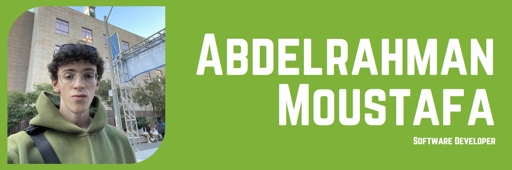

# 👋 Whats up, I'm Abdelrahman!

I'm a software developer passionate about making lives easier with technology.

  
  

## 💻 Projects

*   📚 Netflix Clone: A MERN stack netflix clone for learning purposes.
*   🔍 Termhint: A full-stack application to help newcomers search for synonyms.
*   🍔 Image Classification: Python Tensorflow machine learning model to classify different foods.

## 🔨 Skills

